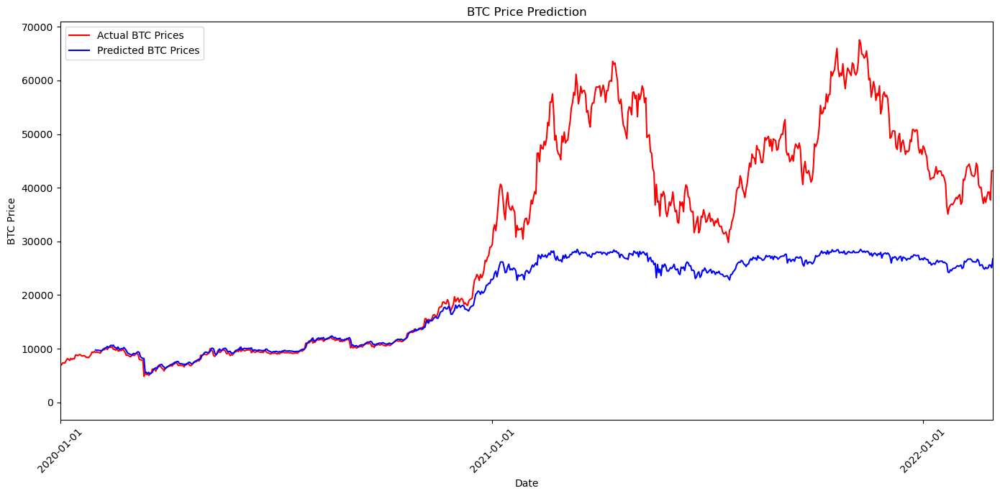

# 🧠 Bitcoin Price Prediction Using RNN

**Project Title**: Predicting Bitcoin Prices Using Recurrent Neural Networks (RNN)    

---

## 📌 Project Overview

This project aims to predict future Bitcoin prices using historical price data and deep learning techniques. By leveraging Recurrent Neural Networks (RNN), we explore how well machine learning models can capture trends and patterns in highly volatile cryptocurrency markets.

---

## 🧩 Problem Definition

Bitcoin is a digital asset with a highly volatile price, making it both attractive and risky for investors. Our goal is to help mitigate investment risk by predicting future Bitcoin prices using past data. Accurate forecasting can guide more informed decision-making in cryptocurrency trading.

---

## 🧠 Model Architecture

We implemented a hybrid RNN model tailored for time-series forecasting. The components include:

- **Bidirectional LSTM**  
  Captures patterns in both forward and backward directions for improved context awareness.

- **GRU (Gated Recurrent Units)**  
  A lighter alternative to LSTM that balances performance and computational efficiency.

- **Dropout Layer**  
  Prevents overfitting by randomly deactivating neurons during training.

- **Dense Layer**  
  Produces the final prediction based on features extracted by RNN layers.

---

## 📂 Dataset

- **Source**: `data/BTC-Daily.csv`  
- **Time Span**: 2,652 days (2014 to March 1, 2022)  
- **Features**:
  | Feature       | Description                                      |
  |---------------|--------------------------------------------------|
  | Unix          | Timestamp of the data                           |
  | Date          | Calendar date                                    |
  | Symbol        | Cryptocurrency symbol (BTC)                      |
  | Open          | Opening price of the day                         |
  | High          | Highest price of the day                         |
  | Low           | Lowest price of the day                          |
  | Close         | Closing price of the day                         |
  | Volume BTC    | Daily transaction volume in BTC                  |
  | Volume USD    | Daily transaction volume in USD                  |

- **Preprocessing**:  
  Data was chronologically sorted. Data from 2014–2020 was used for training, and data from 2020–2022 was used for testing and evaluation.

---

## 📈 Simulation Results

- The model successfully captured the general trends in Bitcoin prices.
- It lagged slightly behind real-time data and smoothed out sharp price fluctuations.
- Sudden spikes and dips were under-predicted, especially during periods of high market volatility (e.g., early 2021).

> **Key Insight**:  
> While the RNN model effectively learns overall trends, it struggles with sharp, short-term price changes due to the limited scope of the dataset.

### 📊 Sample Output Plot



---

## 💬 Discussion

### ✅ Strengths
- Effective at modeling long-term price movements and overall market trends.
- Handles sequential data well using LSTM and GRU layers.

### ⚠️ Limitations
- Underperforms in predicting sudden, high-magnitude price fluctuations.
- Lags behind rapid changes due to the nature of time-series modeling.

### 🔮 Future Improvements
- Integrate external data sources (e.g., news sentiment, economic indicators).
- Test with alternative architectures like Transformer-based models or Temporal Convolutional Networks.
- Use finer-grained temporal data (hourly or minute-level).

---

## 🚀 How to Run

### 1. Clone the repository
```bash
git clone https://github.com/ledlyy/bitcoin-price-prediction-rnn.git
cd bitcoin-price-prediction-rnn
```

### 2. Install required packages
```bash
pip install -r requirements.txt
```

### 3. Train the model
```bash
python main.py --mode train
```

### 4. Run predictions and visualize results
```bash
python main.py --mode predict
```

##  📁 Project Structure
<pre>
```plaintext
bitcoin-price-prediction-rnn/
├── data/
│   └── BTC-Daily.csv              # Dataset file
├── models/
│   └── model.h5                   # Trained model (auto-generated after training)
├── notebooks/
│   └── rnn-bitcoin.ipynb          # Original Jupyter Notebook implementation
├── images/
│   └── prediction_plot.png        # Output visualization (add screenshot here)
├── main.py                        # CLI-based training/prediction script
├── requirements.txt               # Python dependencies
└── README.md                      # This file
```
</pre>


## 📎 Requirements

- Python 3.8+
- Libraries:
  - `numpy`
  - `pandas`
  - `matplotlib`
  - `tensorflow` / `keras`
  - `scikit-learn`

## Final Notes
>This project demonstrates a full ML pipeline from data preprocessing to model evaluation using deep learning on time-series data. It showcases strong skills in Python, RNN modeling, and data science workflow development.

>Feel free to fork, contribute, or use as a reference!